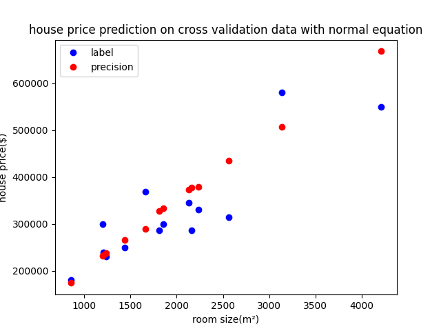

# HW1 线性模型
严胜
### 1 线性回归 Linear Regression（50）

首先导入包
```python
import pandas as pd
import matplotlib.pyplot as plt
import numpy as np
import torch
import math

import os
```
#### 1.1 输入数据集 （10）

data1.txt为回归数据集，每一行为一个样本，前两列为特征，最后一列为目标值。按照7:3的比率划分训练集和验证集。

```python
# 训练集比例
train_proportion = 0.7

############################################################################

# 读取数据集
data_file = os.path.join('HW1 linear model', 'data1.txt')
data = pd.read_csv(data_file,
                   header=None,
                   names=["Room Size", "Room Amount", "Price"])
# 训练集按照比例划分
m = math.floor(len(data)*train_proportion)


############################################################################
# feature scaling 特征缩放
data_ = torch.tensor(data.values, dtype=torch.float32)
# 每列的均值,每列的标准差
data_mean, data_std = data_.mean(dim=0), data_.std(dim=0)
```
$$
x_{n} = \frac{x_{n}-u_{n}}{s_{n}} （其中u_{n}是平均值，s_{n}是标准差）
$$
```python
data_norm = (data_-data_mean)/data_std

# 存储房间大小和房价的平均值和标准差用于之后画图还原坐标轴
room_size_mean, price_mean = data_mean[0], data_mean[2]
room_size_std, price_std = data_std[0], data_std[2]

############################################################################
# 读取数据集

# 转换为张量格式 引入特征 x0=1 （方便之后向量化）
X_train, y_train = torch.cat(
    [torch.ones(m, 1), data_norm[:m, 0:2]], dim=1), data_norm[:m, 2].reshape(-1, 1)
X_cv, y_cv = torch.cat([torch.ones(
    data_.shape[0]-(m+1), 1), data_norm[m+1:, 0:2]], dim=1), data_norm[m+1:, 2].reshape(-1, 1)

```

#### 1.2 线性回归（20）

建立线性回归模型，分别使用正规方程和梯度下降法求得参数解。

- 正规方程

$$
w=(X^TX)^{-1}X^Ty
$$
```python
w = torch.mm(X_train.T, X_train).inverse().mm(
    X_train.T).mm(y_train)
```


- 梯度计算

$$
g=\frac{1}{m}\sum^m_{i=1}(h_\theta(x^{(i)})-y^{(i)})x_j^{(i)}
$$
```python
# 梯度下降法

# 迭代次数
iterations = 10000
# 学习率
lr = 0.01
# 初始化theta
# size: feature_size+1 x 1
w = torch.rand((X_train.size(1), 1), requires_grad=True)


def loss_function(y_pred, y):
    m = len(y_pred)
    return 1/(2*m)*torch.sum((y_pred-y)**2)


# 梯度下降
def gradient_descend(lr, batch_size):
    global w
    with torch.no_grad():
        w -= lr*w.grad/batch_size
        w.grad.zero_()


# 模型
def model(X):
    return torch.mm(X, w)


# 训练
def train(net, loss, updater, X_train, y_train, X_cv, y_cv, num_epochs):
    global w
    log = []
    for epoch in range(num_epochs):
        y_pred = net(X_train)
        # 向量化
        grad = lr*torch.mean((y_pred-y_train)*X_train, dim=0).reshape(-1, 1)
        # 梯度下降
        w = w - grad
        # 计算loss 
        l = loss_function(y_pred, y_train)
        print(f'epoch:{epoch+1},loss:{l}')
        log.append([epoch+1, l.detach().numpy()])
    # 画下loss
    log = np.array(log)
    plt.plot(log[:, 0], log[:, 1])
    plt.show()


train(model, loss_function, gradient_descend,
      X_train, y_train, X_cv, y_cv, iterations)
```
#### 1.3 可视化（20）
定义可视化函数
```python
def visualize(X, y, w, title_suffix):
    # 计算预测值
    y_pred = torch.mm(X, w)
    # 把坐标轴还原
    x_points = (X[:, 1]*room_size_std+room_size_mean).numpy()
    y_points = (y*price_std+price_mean).detach().numpy()
    y_pred_points = (y_pred*price_std+price_mean).detach().numpy()

    plt.title("house price prediction "+title_suffix)
    plt.xlabel("room size(m²)")
    plt.ylabel("house price($)")
    o1, = plt.plot(x_points, y_points, 'o', c='b')
    o2, = plt.plot(x_points, y_pred_points, 'o', c='r')
    plt.legend(handles=[o1, o2], labels=[
               'label', 'precision'], loc='upper left')
    plt.show()
```
- 使用梯度下降法时请可视化loss曲线

- 请可视化验证集上所求回归直线

    **正规方程法**
    
    **梯度下降法**
    
### 2 逻辑回归 Logitstic Regression/Percetron（50）

#### 1.1 输入数据集（10）

data2.txt为分类数据集，每一行为一个样本，前两列为特征，最后一列为目标值。按照7:3的比率划分训练集和验证集。
```python

############################################################################

# 读取数据集
data_file = os.path.join('HW1 linear model', 'data2.txt')
data = pd.read_csv(data_file,
                   header=None,
                   names=["Score1", "Score2", "Price"])
# 训练集按照比例划分
m = math.floor(len(data)*train_proportion)

############################################################################
# 读取数据集
X_train_pd, y_train_pd, X_cv_pd, y_cv_pd = data.iloc[:m,
                                                     :2], data.iloc[:m, -1], data.iloc[m+1:, :2], data.iloc[m+1:, -1]

# 转换为张量格式 引入特征 x0=1 （方便之后向量化）
X_train, y_train = torch.cat(
    [torch.ones(m, 1), torch.tensor(X_train_pd.values, dtype=torch.float64)], dim=1), torch.tensor(y_train_pd.values, dtype=torch.float64).reshape(-1, 1)
X_cv, y_cv = torch.cat([torch.ones(len(X_cv_pd), 1), torch.tensor(
    X_cv_pd.values, dtype=torch.float64)], dim=1), torch.tensor(y_cv_pd.values, dtype=torch.float64).reshape(-1, 1)

############################################################################
# 特征缩放
X_train[:, 1:] = (X_train[:, 1:]-X_train[:, 1:].mean())/X_train[:, 1:].std()
X_cv[:, 1:] = (X_cv[:, 1:]-X_cv[:, 1:].mean())/X_cv[:, 1:].std()
```

#### 1.2 逻辑回归（20）

建立逻辑回归模型，分别使用梯度下降法求得参数解。可尝试使用L2正则化。

- 梯度计算

$$
g=\frac{1}{m}\sum^m_{i=1}(h_\theta(x^{(i)})-y^{(i)})x_j^{(i)}
$$

loss函数为:

$$
J(\theta )=-\frac{1}{m}\sum_{i=1}^{m}[y{}^{(i)}\log_{}({h_{\theta } }(x{}^{(i)}))+(1-y{}^{(i)})\log_{}(1-{h_{\theta } }(x{}^{(i)}))]  
$$

```python
# 梯度下降法

# 迭代次数
iterations = 10000
# 学习率
lr = 0.01
# lambda
lambda_ = 1
# 初始化theta
# size: feature_size+1 x 1
w = torch.randn((X_train.size(1), 1), dtype=torch.float64)


def loss_function(y_pred, y):
    return -torch.mean(y*torch.log(y_pred)+(1-y)*torch.log(1-y_pred))


# 假设函数(加上sigmoid)
def hypothesis(X):
    return 1.0/(1.0+torch.exp(-torch.mm(X, w)))


def predict(y):
    return (y >= 0.5).type(torch.float64)

# 训练
def train(net, loss, X_train, y_train, X_cv, y_cv, num_epochs):
    global w
    log = []
    for epoch in range(num_epochs):
        y_pred = net(X_train)
        # 计算梯度
        grad = torch.mean((y_pred-y_train)*X_train, dim=0).reshape(-1, 1)
        # 梯度下降
        w = w-lr*grad
        l = loss_function(y_pred, y_train)

        y_pred_cv = net(X_cv)
        l_cv = loss_function(y_pred_cv, y_cv)
        print(f'epoch:{epoch+1},train loss:{l}\t cross validation loss:{l_cv}')
        log.append([epoch+1, l.detach().numpy(), l_cv.detach().numpy()])
    # 画下loss
    log = np.array(log)
    plt.plot(log[:, 0], log[:, 1])
    plt.plot(log[:, 0], log[:, 2])
    plt.legend(['loss_train','loss_cv'])
    plt.show()

train(hypothesis, loss_function, X_train, y_train, X_cv, y_cv, iterations)
```
- 梯度计算（L2正则化）

$$
g_j=\frac{1}{m}\sum^m_{i=1}(h_\theta(x^{(i)})-y^{(i)})x_j^{(i)}+2*\lambda*\theta_j
$$

```python
# 训练
def train2(net, loss, X_train, y_train, X_cv, y_cv, num_epochs):
    global w
    log = []
    for epoch in range(num_epochs):
        y_pred = net(X_train)
        # 计算梯度 加上正则化
        grad = torch.mean((y_pred-y_train)*X_train,
                          dim=0).reshape(-1, 1)+2*lambda_*w
        # 排除 theta0
        grad[0] = grad[0]-2*lambda_*w[0]
        # 梯度下降
        w = w-lr*grad
        # 计算loss 加上正则化
        l = loss_function(y_pred, y_train) + lambda_*torch.sum(w**2)
        # 排除 theta0
        l = l - w[0]**2
        y_pred_cv = net(X_cv)
        l_cv = loss_function(y_pred_cv, y_cv)+ lambda_*torch.sum(w**2)
        l_cv = l_cv - w[0]**2
        print(f'epoch:{epoch+1},train loss:{l}\t cross validation loss:{l_cv}')
        log.append([epoch+1, l.detach().numpy(), l_cv.detach().numpy()])
    # 画下loss
    log = np.array(log)
    plt.plot(log[:, 0], log[:, 1])
    plt.plot(log[:, 0], log[:, 2])
    plt.legend(['loss_train','loss_cv'])
    plt.show()
train2(hypothesis, loss_function, X_train, y_train, X_cv, y_cv, iterations)
```

#### 1.3 可视化（20)

定义可视化函数:
```python
def visualize(X, y, w, title_suffix):
    plt.title("prediction "+title_suffix)
    plt.xlabel("score1")
    plt.ylabel("score2")
    x_points = X[:, 1].numpy()
    y_points = X[:, 2].numpy()
    plt.scatter(x_points, y_points, c=y.flatten())
    x1 = np.arange(np.min(x_points), np.max(x_points), 0.1)
    # h_theta=g(theta0*x1+theta1*x2+theta3*x3)移项而来 当然x1=1
    w = w.clone().detach().numpy()
    x2 = -(w[0]*1+w[1]*x1)/w[2]
    plt.plot(x1, x2)
    plt.show()
```
- 使用梯度下降法时请可视化loss曲线

    梯度下降:
    
    梯度下降(正则化):
    
- 请可视化验证集上所求分类直线

    未正则化:
    
    正则化:
    
### 3 Bonus：分析 （10）

- 对比正规方程和梯度下降法，基于实验结果比较两者之间的优劣。

    答：对比实验结果感觉两者效果差不多。特征方程代码上实现比较简洁一点，但当特征过多和数据过多时使用正规方程计算w可能会导致内存溢出。
- 基于实验结果，对比没有正则化的情况和L2正则化的逻辑回归模型。

    答：根据实验结果，观察loss图像，在未做正则化时，明显假设函数在训练集上比在验证集上表现得更好，且出现了过拟合的现象。而加入L2正则化之后，loss曲线不管是训练集还是测试集都表现正常。再观察验证集上的决策边界直线图，明显L2正则化后的分界线稍微接近正确预测结果一点。
- 分析特征归一化和不做归一化对模型训练的影响。

    答：实验表明，在不做归一化时，loss的值可能会很大（只对特征做了归一化，未对标签做归一化）或者loss曲线会变得很奇怪（乱跑），这可能是梯度下降时反复波动导致的。在做了特征归一化之后，loss曲线明显正常，但在绘制图像时坐标轴所表示的信息也模糊了。
    

