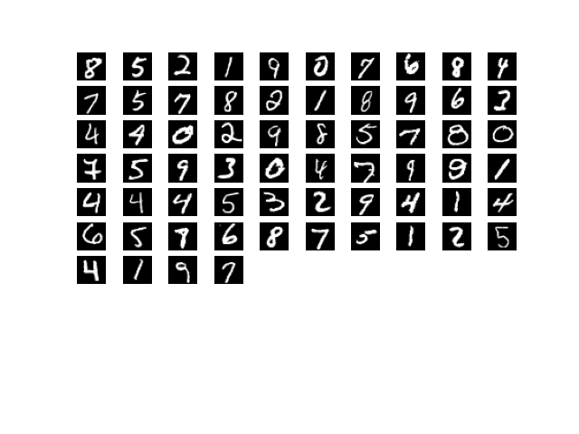

# HW2 MNIST手写体数字识别
严胜
### 1 pytorch环境安装（10）

安装代码如下：

```script
conda activate d2l
pip3 install pytorch torchvision
......
```

### 2 MNIST识别（90）

#### 2.1 输入数据集 （10）

data文件夹中是MNIST分类数据集，训练数据集包含 60000 个样本, 测试数据集包含 10000 样本。每个样本为单通道图片，长宽均为28。
```python
# 导入数据集
import torch
from torchvision import datasets, transforms

train_datasets = datasets.MNIST(root='HW2 neural network/data',
                                train=True, transform=transforms.ToTensor(), download=False)
test_datasets = datasets.MNIST(root='HW2 neural network/data',
                               train=False, transform=transforms.ToTensor(), download=False)
# shuffle=True 打乱数据集顺序 增强泛化能力
train_loader = torch.utils.data.DataLoader(
    dataset=train_datasets, batch_size=batch_size, shuffle=True)
test_loader = torch.utils.data.DataLoader(
    dataset=test_datasets, batch_size=batch_size, shuffle=False)
```

#### 2.2 数据集可视化（20）

使用matplotlib工具包将数据集可视化。
```python
from matplotlib import pyplot as plt

# 数据集可视化
images, labels = iter(train_loader).next()
for i in range(len(labels)):
    plt.subplot(10, 10, i+1)
    plt.imshow(images[i, ...].reshape((28, 28)), cmap="gray")
    # 关闭坐标轴
    plt.axis('off')
plt.show()
```
可视化一个batch的数据


#### 2.3 模型建立（20）

- 利用卷积层和线性层建立一个深度模型
- 如果熟悉的同学，可以尝试其他层，例如dropout、batchnorm、layernorm、maxpooling等，具体的函数接口可以在官方文档中找到

利用torch建立一个如下图的4层的模型:


具体代码如下(有一点长):

```python
from torch import nn


# 定义深层次可分离卷积
class DeepWise_PointWise_Conv(nn.Module):
    def __init__(self, in_channels, out_channels):
        super(DeepWise_PointWise_Conv, self).__init__()
        self.deepwise_layer = nn.Conv2d(
            in_channels,
            out_channels=in_channels,
            kernel_size=3,
            # 用分组计算性质来实现输入通道和输出通道相同
            groups=in_channels,
        )
        self.pointwise_layer = nn.Conv2d(
            in_channels,
            out_channels,
            kernel_size=1
        )

    def forward(self, X):
        return self.pointwise_layer(self.deepwise_layer(X))


# 模型建立
class YanNet_is_not_all_you_need(nn.Module):
    def __init__(self):
        super(YanNet_is_not_all_you_need, self).__init__()
        # 输入(1,28,28) 输出 (32, 28, 28)
        self.layer1 = nn.Sequential(
            nn.Conv2d(
                in_channels=1,
                out_channels=32,
                kernel_size=5,
                stride=1,
                padding=2),
            nn.ReLU()
        )
        # 输入(32, 28, 28) 输出(64, 13 ,13)
        self.layer2 = nn.Sequential(
            nn.Conv2d(
                in_channels=32,
                out_channels=64,
                kernel_size=3,
                stride=1,
                padding=0
            ),
            nn.BatchNorm2d(64),
            nn.ReLU(),
            nn.MaxPool2d(kernel_size=2, stride=2)
        )
        # 输入(64,13,13) 输出(8,11,11)
        self.layer3 = nn.Sequential(
            # 使用深层次可分离卷积
            DeepWise_PointWise_Conv(64, 8),
            nn.ReLU(),
        )
        self.layer4 = nn.Sequential(
            # 平铺
            nn.Flatten(),
            nn.Dropout(p=0.2),
            nn.Linear(in_features=8*11*11, out_features=10),
            nn.LogSoftmax(dim=1)
            )

    # 前向传播函数
    def forward(self, X):
        X = self.layer1(X)
        X = self.layer2(X)
        X = self.layer3(X)
        output = self.layer4(X)
        return output
```

#### 2.4 模型训练（20）

- 训练3个epoch，观察loss的变化

使用随机梯度下降优化器,定义损失函数为最大似然函数(查阅资料发现torch里的交叉熵损失函数（cross-entropy loss）是softmax+log+NLLLOSS,与我们平时理解的交叉熵损失函数有一些出入),这样能更好的与本模型结合。
```python
from torch import optim
from torch.nn import functional as F
import numpy as np

# 最大似然函数
loss_function = nn.NLLLoss()

def train():
    # 模型
    model = YanNet_is_not_all_you_need()
    # 随机梯度下降优化器
    optimizer = optim.SGD(model.parameters(), lr=learning_rate)
    log_train, log_test = [], []
    for epoch in range(epochs):
        for batch_idx, (X, y) in enumerate(train_loader):
            # Sets the module in train mode.
            model.train()
            # 清空梯度
            optimizer.zero_grad()
            # 调用模型输出预测值
            output = model(X)
            # 计算loss
            loss = loss_function(output, y)
            # 反向传播计算梯度
            loss.backward()
            # 更新模型参数
            optimizer.step()
            if batch_idx % 10 == 0:
                log_train.append(
                    [((epoch*len(train_loader.dataset))+(batch_size*batch_idx+1)), loss.detach().numpy()])
            if batch_idx % 100 == 0:
                print("epoch[{}]: batch:[{}/{}] loss:[{:0.10f}]".format(epoch +
                      1, batch_size*batch_idx+1, len(train_loader.dataset), loss))
        evaluate(model, test_loader, log_test, epoch)
    # 画下loss
    log_train = np.array(log_train)
    # log_test = np.array(log_test)
    plt.title(
        "loss changes in [{}] epochs usiing cross-entropy loss]".format(epochs))
    plt.plot(log_train[:, 0], log_train[:, 1])
    # plt.plot(log_test[:, 0], log_test[:, 1])
    # plt.legend(['loss_train', 'loss_test'])
    plt.ylabel("loss")
    plt.xlabel("ierations")
    plt.show()
```
- 将loss可视化出来


该图表示每迭代10次数据集记录一次loss,观察图像可以发现虽然loss在小幅度波动，但整体为下降趋势。

#### 2.5 性能测试（20）

- 将训练好的模型在测试集上进行测试，观察准确率

定义评估函数:
```python
def evaluate(model, test_loader, log, epoch):
    right_num = 0
    for batch_idx, (X, y) in enumerate(test_loader):
        # Sets the module in evaluation mode.
        model.eval()
        output = model(X)
        # 输出的下标即预测值
        y_pred = torch.max(output, dim=1)[1]
        right_num = right_num + torch.eq(y_pred, y).sum().item()
        if batch_idx % 10 == 0:
            # 计算在测试集上的loss
            loss = loss_function(output, y)
            log.append(
                [((epoch*len(test_loader.dataset))+(batch_size*batch_idx+1)), loss.detach().numpy()])
    print("test accurecny:[{:0.6f}]%".format(
        right_num*100/len(test_loader.dataset)))
```
经过3次epoch后，发现模型在测试集上的准确率达到了**98.33%**,以下为程序运行时的输出信息:
```bash
epoch[1]: batch:[1/60000] loss:[2.3659052849]
epoch[1]: batch:[6401/60000] loss:[0.5405305028]
epoch[1]: batch:[12801/60000] loss:[0.3101408780]
epoch[1]: batch:[19201/60000] loss:[0.4763113260]
epoch[1]: batch:[25601/60000] loss:[0.1502625793]
epoch[1]: batch:[32001/60000] loss:[0.1673139483]
epoch[1]: batch:[38401/60000] loss:[0.0855514482]
epoch[1]: batch:[44801/60000] loss:[0.1039535999]
epoch[1]: batch:[51201/60000] loss:[0.0786963478]
epoch[1]: batch:[57601/60000] loss:[0.0605739951]
test accurecny:[97.290000]%
epoch[2]: batch:[1/60000] loss:[0.1080495417]
epoch[2]: batch:[6401/60000] loss:[0.1694334298]
epoch[2]: batch:[12801/60000] loss:[0.0713618025]
epoch[2]: batch:[19201/60000] loss:[0.0140964882]
epoch[2]: batch:[25601/60000] loss:[0.0890717283]
epoch[2]: batch:[32001/60000] loss:[0.0066941315]
epoch[2]: batch:[38401/60000] loss:[0.1721237898]
epoch[2]: batch:[44801/60000] loss:[0.1171326861]
epoch[2]: batch:[51201/60000] loss:[0.0523107871]
epoch[2]: batch:[57601/60000] loss:[0.0536517128]
test accurecny:[98.080000]%
epoch[3]: batch:[1/60000] loss:[0.0093520377]
epoch[3]: batch:[6401/60000] loss:[0.0585878715]
epoch[3]: batch:[12801/60000] loss:[0.0411668979]
epoch[3]: batch:[19201/60000] loss:[0.0381409675]
epoch[3]: batch:[25601/60000] loss:[0.0476497300]
epoch[3]: batch:[32001/60000] loss:[0.0244822092]
epoch[3]: batch:[38401/60000] loss:[0.1037973017]
epoch[3]: batch:[44801/60000] loss:[0.0708079040]
epoch[3]: batch:[51201/60000] loss:[0.2275616974]
epoch[3]: batch:[57601/60000] loss:[0.0768440291]
test accurecny:[98.330000]%
```
### 3 后言

据许多小伙伴反应，第一次的作业好像比较难。那么这一次作业对你们来说应该更是一个挑战。但MNIST任务属于深度学习中的”hello world”，是每个入门深度学习必然需要经历的项目。

希望大家可以懂得查阅官方文档，这是程序员必备的基本功。

然后有问题的小伙伴可以积极在issue上进行提问，我也希望能把issue区当成大家讨论作业讨论代码的一个社区，要学会借助社区的力量，你遇到的问题必然别人也会遇到，大家就可以在社区讨论解决，我如果有时间的话也会回复一下提问的小伙伴。

我会在issue上开一个帖子叫【mnist benchmark】https://github.com/mousecpn/MachineLearning_HW_CQUT/issues/2，大家可以把自己的测试集性能发上来，并分享自己的模型训练心得（模型结构、优化器参数等等）

