# HW3 支持向量机

### 1 线性SVM（50）

#### 1.1 输入数据集 （10）

data1.mat为分类数据集，每一行为一个样本，前两列为特征，最后一列为目标值。按照7:3的比率划分训练集和验证集。

创建data.py文件并定义load_data函数，使用scipy包加载'.mat'文件并使用sklearn.utils包来随机打乱数据集顺序。代码如下：
```python
# data.py
import scipy.io as sio
import numpy as np
import pandas as pd
from matplotlib import pyplot as plt
from sklearn.utils import shuffle

import math
from os import path

def load_data(file_name, train_proportion=0.7, visualize=False):
    data_dict = sio.loadmat(path.join('HW3 SVM', 'data', file_name))
    X_pd = pd.DataFrame(data_dict['X'], columns=['feature1', 'feature2'])
    y_pd = pd.DataFrame(data_dict['y'], columns=['y'])
    if visualize:
        plt.title("visualize "+file_name)
        plt.scatter(np.asarray(X_pd)[:, 0], np.asarray(
            X_pd)[:, 1], c=np.asarray(y_pd).flatten(), s=20)
        plt.show()
    # shuffle一下
    data_pd = shuffle(pd.concat([X_pd, y_pd], axis=1))
    # 训练集按照比例划分
    m = math.floor(len(data_pd)*train_proportion)
    # 按照比例读取训练集和验证集
    X_train, y_train = np.asarray(
        data_pd.iloc[:m, :2]), np.asarray(data_pd.iloc[:m, -1])
    X_cv, y_cv = np.asarray(data_pd.iloc[m:, :2]), np.asarray(
        data_pd.iloc[m:, -1])
    return X_train, y_train, X_cv, y_cv

```

```python
# main.py

import data
# 加载数据集
file_name = 'data1.mat'
X_train, y_train, X_cv, y_cv = data.load_data(
    file_name, train_proportion=0.7, visualize=True)
```
'data1.mat'数据集可视化：

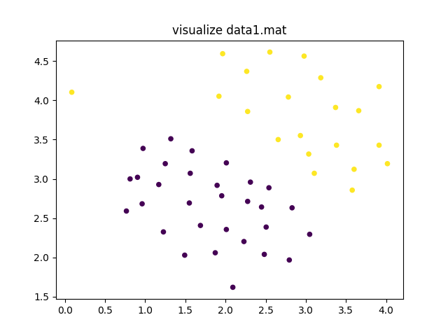

#### 1.2 模型训练（20）

使用sklearn工具包，调用SVM.linearSVC接口对模型进行训练。

1. 创建evaluation.py文件并定义evaluate函数
```python
# 评估准确率
def evaluate(model, X, y):
    y_predict = model.predict(X)
    accuracy = (y_predict == y).sum()/len(y)
    return accuracy
```

2. 创建visualize.py并定义visualize_boundary函数
```python
import numpy as np
from matplotlib import pyplot as plt
from evaluation import evaluate

def visualize_boundary(model, X, y, kernel, target='training'):
    # +0.1 -0.1的目的：避免将样本绘制到图的边缘区域
    x1 = np.linspace(np.min(X[:, 0])-0.1, np.max(
        X[:, 0])+0.1, 100).reshape(-1, 1)  # 100 x 1
    x2 = np.linspace(np.min(X[:, 1])-0.1, np.max(
        X[:, 1])+0.1, 100).reshape(-1, 1)  # 100 x 1
    x1, x2 = np.meshgrid(x1, x2)
    # 列堆叠成坐标网格
    X_coordinate = np.column_stack((x1.flatten(), x2.flatten()))
    # 使用SVM直接输出预测值
    y_predict = model.predict(X_coordinate).reshape(x1.shape)
    # 绘制图像
    plt.contourf(x1, x2, y_predict, cmap=plt.cm.Spectral, alpha=0.8)
    plt.scatter(X[:, 0], X[:, 1], c=y, s=20)
    plt.xlabel('feature1')
    plt.ylabel('feature2')
    plt.title("using SVM({} kernel) on {} dataset, accurency:[{:.2f}%]".format(
        kernel, target, evaluate(model, X, y)*100))
    plt.show()

```

3. 使用sklearn.svm包的linearSVC接口训练模型

```python
import numpy as np
from sklearn import svm as SVM

import visualize as viz
from evaluation import evaluate
import data

# 超参数
C = 1.0
# 定义分类器
clf = SVM.LinearSVC(C=C)
# 训练模型
clf.fit(X_train, y_train)
viz.visualize_boundary(clf, X_train, y_train, 'linear')
ratio = evaluate(clf, X_cv, y_cv)
print("test accuracy:\t{:.6f}%".format(ratio*100))
viz.visualize_boundary(clf, X_cv, y_cv, 'linear', 'test')
```

#### 1.3 分析（20）

- 可视化决策边界，并输出验证集准确率

    在训练集下的决策边界如下(**C=1.0**)，训练集准确率为**97.14%**
    
    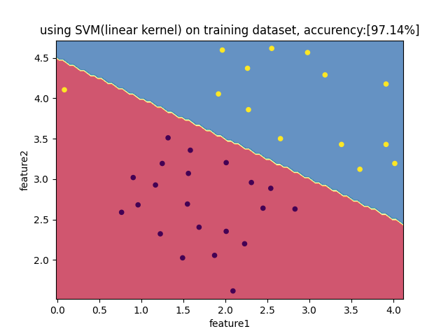
    
    在验证集下的决策边界如下(**C=1.0**)，验证集准确率为**100%**

    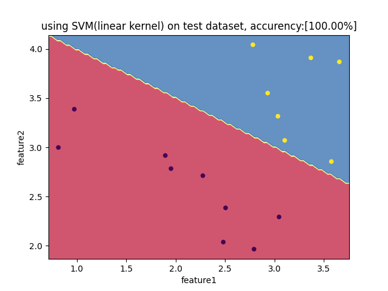
- 基于实验，分析软惩罚参数C对于决策边界的影响
<center class="half">
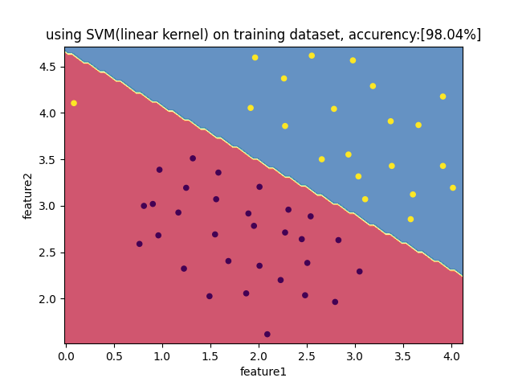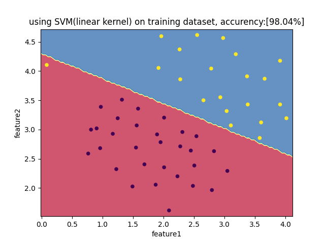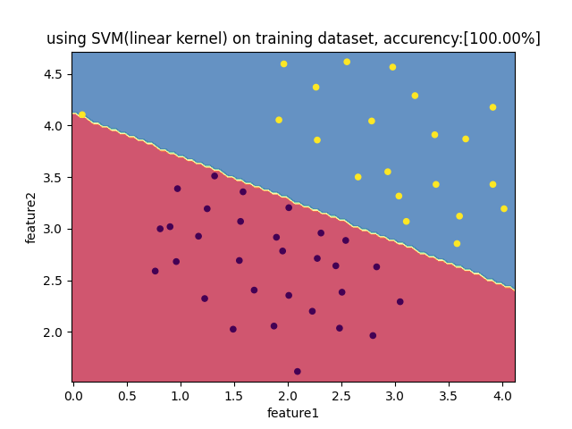
</center>

现分别可视化软惩罚参数C等于1、100、1000时的决策边界(所有数据集)，观察上图可知当C越来越大时，决策边界能更好的把正样本和负样本完全分开，而当C很小时，它可以忽略掉一些异常点的影响（例如左上角的黄点）。也就是说C较大时，可能会导致过拟合，高方差。C较小时，可能会导致低拟合，高偏差。

### 2 非线性SVM（50）

#### 1.1 输入数据集（10）

data2.mat为分类数据集，每一行为一个样本，前两列为特征，最后一列为目标值。按照7:3的比率划分训练集和验证集。

```python
file_name = 'data2.mat'
X_train, y_train, X_cv, y_cv = data.load_data(
    file_name, train_proportion=0.7, visualize=False)
```
#### 1.2 模型训练（10）

- 使用sklearn工具包，调用SVM.SVC接口对模型进行训练，kernel选择rbf。

```python
kernel = 'rbf'
# 定义分类器
clf = SVM.SVC(C=C, kernel=kernel)
# 训练模型
clf.fit(X_train, y_train)
viz.visualize_boundary(clf, X_train, y_train, kernel)
ratio = evaluate(clf, X_cv, y_cv)
print("the accuracy of test dataset with {:10s} kernel:\t{:.6f}%".format(kernel, ratio*100))
viz.visualize_boundary(clf, X_cv, y_cv, kernel, 'test')
```

#### 1.3 分析（30)

- 换用不同的kernel，分析不同kernel和不同参数值对于验证集准确率的影响。
<center class="half">
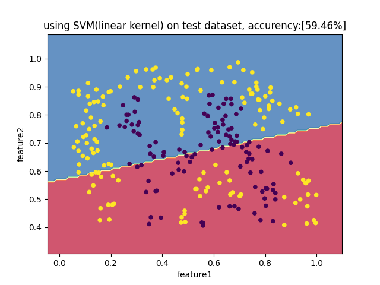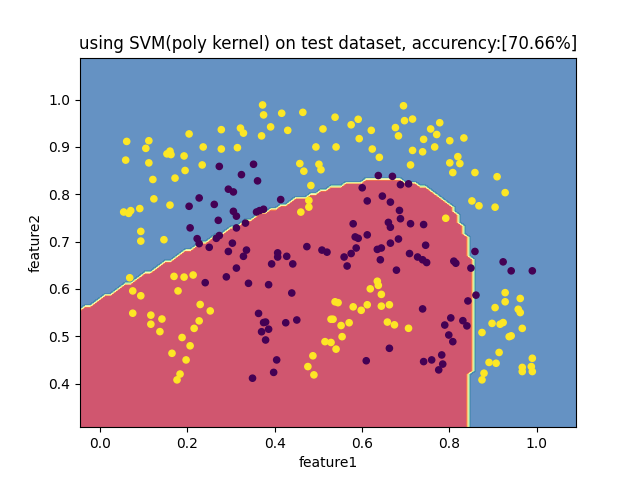
</center>
<center class="half">
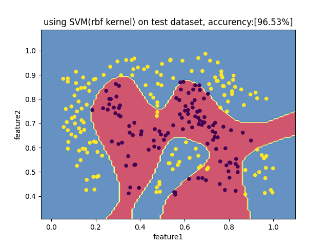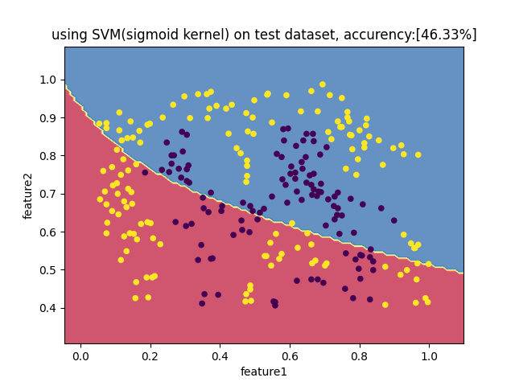
</center>

分别可视化['linear', 'poly', 'rbf', 'sigmoid']四种kernel的分类结果。针对验证集可以发现，线性核和sigmoid核完全是瞎猜，根本不能很好的拟合数据。而多项式核虽说好点，但还有很大的上升空间。可以发现对于无法用直线进行分隔的分类问题，高斯核应该为首选。

<center class="half">
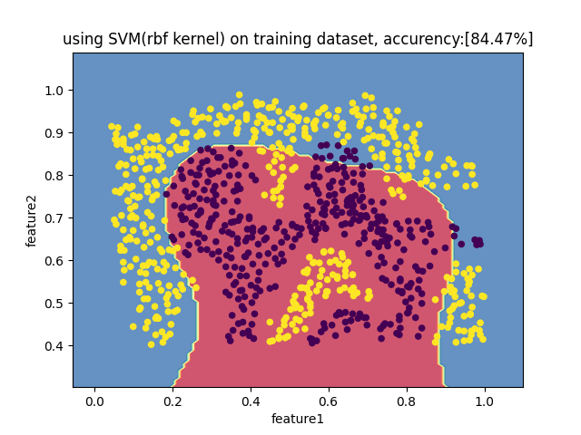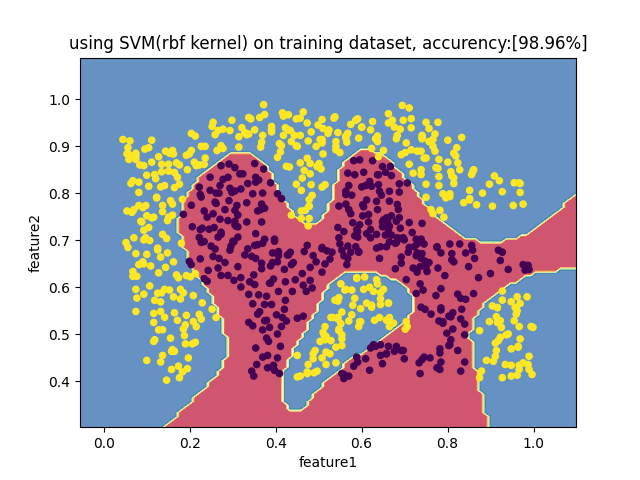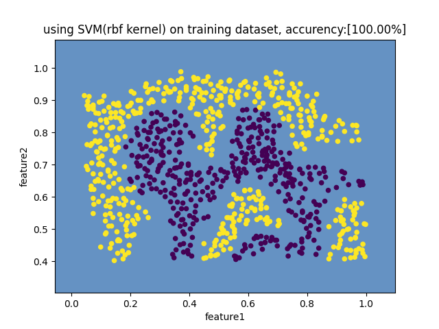
</center>

设高斯核$k(x_{i},x_{j})=exp(-\frac{\left \| x_{i}-x_{j} \right \|^{2}  }{2\delta ^{2}} )$中$\delta$分别为1（上图左）、10（上图中）1e8(上图右)。观察图可知，当$\delta$较大时，准确率较高，泛化能力好。而当$\delta$非常大时，分类器会将所有的样本归为同一类。

### 3 Bonus（20）

- 对数据集data3进行SVM训练，并试图找到最好的一组超参数，撰写分析报告。

    设超参数C为[1,2,3,....,997,998,999,1000]，高斯核$k(x_{i},x_{j})=exp(-\frac{\left \| x_{i}-x_{j} \right \|^{2}  }{2\delta ^{2}} )$的$\delta$为[0.01, 0.05, 0.1, 0.5, 1, 5, 10, 50]。将两个数组的笛卡尔积作为参数组合，在训练每轮不同的参数组合时，随机加载数据集50次，取50次的平均准确率作为该参数组的效率。在训练完成后发现当**C=121**,**$\delta$=1.0**时，分类器在验证集上的平均准确率高达**93.781250%**，下图为$\delta=1.0$时，验证集准确率和软惩罚参数C的关系图。不难看出当C越大，test accuracy在慢慢减小，分类器的过拟合程度越高。

    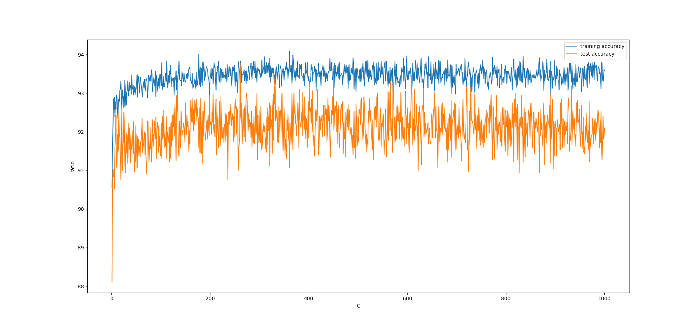

    代码如下:
    ```python
    ######################################################################################
    # 加载数据集
    file_name = 'data3.mat'
    shuffle_num = 50
    kernel = 'rbf'
    C_max = 1000
    ######################################################################################
    
    def main():
        log = []
        sigmas = [0.01, 0.05, 0.1, 0.5, 1, 5, 10, 50]
        for C in range(1, C_max+1):
            for sigma in sigmas:
                ratios = []
                for _ in range(shuffle_num):
                    # 随机加载shuffle_num次数据
                    X_train, y_train, X_cv, y_cv = data.load_data(
                        file_name, train_proportion=0.7, visualize=False)
                    # 定义分类器
                    clf = SVM.SVC(C=C, kernel=kernel, gamma=sigma)
                    # 训练模型
                    clf.fit(X_train, y_train)
                    ratios.append([evaluate(clf, X_train, y_train),
                                evaluate(clf, X_cv, y_cv)])
                ratios = np.array(ratios)
                # 求出平均准确率
                means = np.mean(ratios, axis=0) * 100
                log.append([C, sigma, means[0], means[1]])
                print("paramater C=[{:4d}]\t sigma=[{}]\tmean training accuracy:{:.6f}%\tmean test accuracy:{:.6f}%".format(
                    C, sigma, means[0], means[1]))
        log = np.array(log)
        X_train, y_train, X_cv, y_cv = data.load_data(
            file_name, train_proportion=0.7, visualize=False)
        # 查找验证集上准确率最高的参数C
        the_best = log[np.argmax(log, axis=0)[3], :]
        C_best, sigma_best = the_best[0], the_best[1]
        clf = SVM.SVC(C=C_best, kernel=kernel)
        clf.fit(X_train, y_train)
        print("the best paramater C is:{}\tsigma=[{}]\ttraining accuracy:{:.6f}%\ttest accuracy:{:.6f}%".format(
            C_best, sigma_best, the_best[2], the_best[3]))
        # 可视化在最优sigma的情况下的数据集准确率变化
        indexs = np.where(log[:, 1] == sigma_best)[0]
        plt.plot(log[indexs, 0], log[indexs, 2])
        plt.plot(log[indexs, 0], log[indexs, 3])
        plt.legend(['training accuracy', 'test accuracy'])
        plt.xlabel("C")
        plt.ylabel("ratio")
        plt.show()
        viz.visualize_boundary(clf, X_train, y_train, kernel)
        viz.visualize_boundary(clf, X_cv, y_cv, kernel, 'test')
    

    if __name__ == "__main__":
        main()
    ```
    部分输出如下：
    ```bash
    paramater C=[ 997]       sigma=[0.01]   mean training accuracy:92.843537%       mean test accuracy:92.062500%
    paramater C=[ 997]       sigma=[0.05]   mean training accuracy:92.734694%       mean test accuracy:92.406250%
    paramater C=[ 997]       sigma=[0.1]    mean training accuracy:93.170068%       mean test accuracy:91.562500%
    paramater C=[ 997]       sigma=[0.5]    mean training accuracy:93.129252%       mean test accuracy:92.437500%
    paramater C=[ 997]       sigma=[1]      mean training accuracy:93.306122%       mean test accuracy:92.406250%
    paramater C=[ 997]       sigma=[5]      mean training accuracy:94.149660%       mean test accuracy:90.312500%
    paramater C=[ 997]       sigma=[10]     mean training accuracy:94.816327%       mean test accuracy:88.187500%
    paramater C=[ 997]       sigma=[50]     mean training accuracy:99.850340%       mean test accuracy:84.218750%
    paramater C=[ 998]       sigma=[0.01]   mean training accuracy:93.020408%       mean test accuracy:92.250000%
    paramater C=[ 998]       sigma=[0.05]   mean training accuracy:93.006803%       mean test accuracy:92.125000%
    paramater C=[ 998]       sigma=[0.1]    mean training accuracy:92.979592%       mean test accuracy:92.093750%
    paramater C=[ 998]       sigma=[0.5]    mean training accuracy:93.292517%       mean test accuracy:91.781250%
    paramater C=[ 998]       sigma=[1]      mean training accuracy:93.333333%       mean test accuracy:91.812500%
    paramater C=[ 998]       sigma=[5]      mean training accuracy:94.095238%       mean test accuracy:89.031250%
    paramater C=[ 998]       sigma=[10]     mean training accuracy:94.639456%       mean test accuracy:88.125000%
    paramater C=[ 998]       sigma=[50]     mean training accuracy:99.782313%       mean test accuracy:84.937500%
    paramater C=[ 999]       sigma=[0.01]   mean training accuracy:93.061224%       mean test accuracy:91.500000%
    paramater C=[ 999]       sigma=[0.05]   mean training accuracy:93.238095%       mean test accuracy:91.312500%
    paramater C=[ 999]       sigma=[0.1]    mean training accuracy:92.816327%       mean test accuracy:91.656250%
    paramater C=[ 999]       sigma=[0.5]    mean training accuracy:93.428571%       mean test accuracy:91.625000%
    paramater C=[ 999]       sigma=[1]      mean training accuracy:93.619048%       mean test accuracy:91.843750%
    paramater C=[ 999]       sigma=[5]      mean training accuracy:94.095238%       mean test accuracy:90.312500%
    paramater C=[ 999]       sigma=[10]     mean training accuracy:95.006803%       mean test accuracy:88.437500%
    paramater C=[ 999]       sigma=[50]     mean training accuracy:99.891156%       mean test accuracy:84.218750%
    paramater C=[1000]       sigma=[0.01]   mean training accuracy:93.102041%       mean test accuracy:92.625000%
    paramater C=[1000]       sigma=[0.05]   mean training accuracy:92.884354%       mean test accuracy:92.187500%
    paramater C=[1000]       sigma=[0.1]    mean training accuracy:93.197279%       mean test accuracy:91.718750%
    paramater C=[1000]       sigma=[0.5]    mean training accuracy:93.455782%       mean test accuracy:91.781250%
    paramater C=[1000]       sigma=[1]      mean training accuracy:93.578231%       mean test accuracy:92.093750%
    paramater C=[1000]       sigma=[5]      mean training accuracy:93.863946%       mean test accuracy:90.343750%
    paramater C=[1000]       sigma=[10]     mean training accuracy:94.789116%       mean test accuracy:88.062500%
    paramater C=[1000]       sigma=[50]     mean training accuracy:99.782313%       mean test accuracy:84.843750%
    the best paramater C is:261.0   sigma=[1.0]     training accuracy:93.102041%    test accuracy:93.781250%
    ```