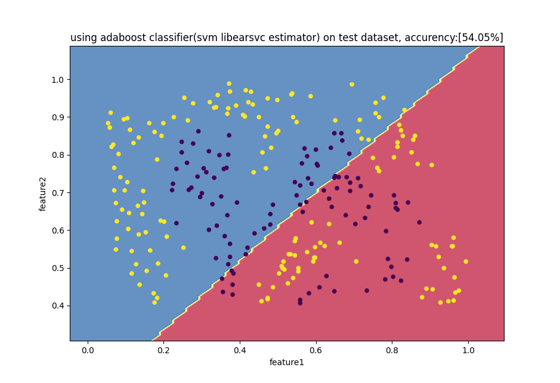

# HW4 集成模型

严胜

### 1 adaboost（50）

#### 1.1 输入数据集 （10）

data1.mat 为分类数据集，每一行为一个样本，前两列为特征，最后一列为目标值。按照 7:3 的比率划分训练集和验证集。

同 HW3 的方式

```python
import scipy.io as sio
import numpy as np
import pandas as pd
from matplotlib import pyplot as plt
from sklearn.utils import shuffle

import math
from os import path


def load_data(file_name, train_proportion=0.7, visualize=False):
    data_dict = sio.loadmat(path.join('HW4 emsemble', file_name))
    X_pd = pd.DataFrame(data_dict['X'], columns=['feature1', 'feature2'])
    y_pd = pd.DataFrame(data_dict['y'], columns=['y'])
    if visualize:
        plt.title("visualize "+file_name)
        plt.scatter(np.asarray(X_pd)[:, 0], np.asarray(
            X_pd)[:, 1], c=np.asarray(y_pd).flatten(), s=20)
        plt.show()
    # shuffle一下
    data_pd = shuffle(pd.concat([X_pd, y_pd], axis=1))
    # 训练集按照比例划分
    m = math.floor(len(data_pd)*train_proportion)
    # 按照比例读取训练集和验证集
    X_train, y_train = np.asarray(
        data_pd.iloc[:m, :2]), np.asarray(data_pd.iloc[:m, -1])
    X_cv, y_cv = np.asarray(data_pd.iloc[m:, :2]), np.asarray(
        data_pd.iloc[m:, -1])
    return X_train, y_train, X_cv, y_cv
```

#### 1.2 模型训练（20）

使用 sklearn 工具包，调用 ensemble.AdaBoostClassifier 接口对模型进行训练。

导入相关包

```python
import scipy.io as sio
import numpy as np
import pandas as pd
from sklearn.utils import shuffle
from sklearn.ensemble import AdaBoostClassifier, RandomForestClassifier

###########################导入不同基分类器开始###############################
from sklearn.tree import DecisionTreeClassifier
from sklearn.naive_bayes import GaussianNB
from sklearn.svm import LinearSVC
from sklearn.linear_model import LogisticRegression, Perceptron
###########################导入不同基分类器结束###############################

import math
from os import path
import data
import visualize as viz
```

```python

def train():
    # 定义分类器
    # clf = AdaBoostClassifier(base_estimator=GaussianNB() ,n_estimators=1000)
    clf = AdaBoostClassifier(
        base_estimator=DecisionTreeClassifier(), n_estimators=10)
    # 训练模型
    clf.fit(X_train, y_train)
    viz.visualize_boundary(clf, X_cv, y_cv, 'decision tree', False)

```

#### 1.3 分析（20）

- 可视化决策边界，并输出验证集准确率


- 基于实验，分析不同的基分类器和基分类器数量对于模型性能的影响

不同的基分类器:

<center class="half">

</center>
<center class="half">

</center>

分别使用**logistic rergression、SVM linearSVC、guassion naive bayes、 decision tree**四个基分类器训练模型。观察四张图可知，随着基分类器的改变，分类结果的决策边界也会根据其特性而改变。在众多的基分类器里面，使用决策树及分类器的在测试集上的准确率能达到最高值**93.82%**

不同的基分类器数量:

<center class="half">

</center>
<center class="half">

</center>

如上图所示，分别将*n_estimators*设为 1、10、100、1000。观察图像可知，随着 n 不断增大，决策边界也越来越细腻，一些特定的点也被成功分类

### 2 随机森林（50）

#### 1.1 输入数据集（10）

data1.mat 为分类数据集，每一行为一个样本，前两列为特征，最后一列为目标值。按照 7:3 的比率划分训练集和验证集。

同 1.1

#### 1.2 模型训练（10）

使用 sklearn 工具包，调用 ensemble.RandomForestClassifier 接口对模型进行训练。

```python
def train():
    # 定义分类器
    clf = RandomForestClassifier()
    # 训练模型
    clf.fit(X_train, y_train)
    viz.visualize_boundary(clf, X_cv, y_cv, '', False)

```

#### 1.3 分析（30)

- 换用不同的 n_estimators、criterion、max_depth、min_samples_split ，分析其对于验证集准确率的影响。

使用 sklearn 自带的网格搜索工具对随机森林模型进行参数调优，首先对基分类器数量进行单独调优（放一起弄电脑太慢了），设置 n_estimators 为 1 到 100 的奇数，最后发现当 n_estimators=33 时，AUC 分数高达**0.9942198024264963**。在对其他三个参数同时进行调优，发现当`{'criterion': 'entropy', 'max_depth': 11, 'min_samples_leaf': 1}`时，AUC 分数高达**0.9957411290654168**。使用这些参数后，模型在验证集准确率达到了最高**98.07%**

terminal 输出如下：

```bash
grid search beginning
----------------------------------------------------------------------------------------------------
the best n_estimators is:33 scores:0.9942198024264963
----------------------------------------------------------------------------------------------------
using it to fit the other best params...
----------------------------------------------------------------------------------------------------
the best params is:{'criterion': 'entropy', 'max_depth': 11, 'min_samples_leaf': 1} scores:0.9957411290654168
----------------------------------------------------------------------------------------------------
using best params above,the score got on test set is 98.06949806949807%
----------------------------------------------------------------------------------------------------
```

代码如下：

```python
def grid_search_cv():
    from sklearn.model_selection import GridSearchCV
    param_test1 = {
        'n_estimators': range(1, 100, 2),
    }
    param_test2 = {
        # 评价标准
        'criterion': ["gini", "entropy"],
        # 决策树最大深度
        'max_depth': range(1, 20, 2),
        # 叶子节点最少样本数
        'min_samples_leaf': range(1, 10)
    }
    # oob_score：否采用袋外样本来评估模型的好坏
    clf = RandomForestClassifier(oob_score=False, random_state=10)
    gsearch = GridSearchCV(estimator=clf,
                           param_grid=param_test1, scoring='roc_auc', cv=5)
    print('grid search beginning')
    gsearch.fit(X_train, y_train)
    print('-'*100)
    best_n_estimators = gsearch.best_params_['n_estimators']
    print('the best n_estimators is:{} scores:{}'.format(
        best_n_estimators, gsearch.best_score_))
    print('-'*100)
    print('using it to fit the other best params...')
    clf = RandomForestClassifier(
        n_estimators=best_n_estimators, oob_score=False, random_state=10)
    gsearch = GridSearchCV(estimator=clf,
                           param_grid=param_test2, scoring='roc_auc', cv=5)
    gsearch.fit(X_train, y_train)
    print('-'*100)
    best_criterion = gsearch.best_params_['criterion']
    best_max_depth = gsearch.best_params_['max_depth']
    best_min_samples_leaf = gsearch.best_params_['min_samples_leaf']
    print('the best params is:{} scores:{}'.format(
        gsearch.best_params_, gsearch.best_score_))
    print('-'*100)
    clf = RandomForestClassifier(
        n_estimators=best_n_estimators,
        criterion=best_criterion,
        max_depth=best_max_depth,
        min_samples_leaf=best_min_samples_leaf,
        oob_score=False,
        random_state=10)
    clf.fit(X_train, y_train)
    score = clf.score(X_cv, y_cv)
    print('using best params above,the score got on test set is {}%'.format(score*100))
    print('-'*100)

```

### 3 Bonus（20）

#### 3.1 使用 Iris 数据集分别对 adaboost 和随机森林进行训练。

Iris 也称鸢尾花卉数据集，是一类多重变量分析的数据集。数据集包含 150 个数据样本，分为 3 类，每类 50 个数据，每个数据包含 4 个属性。可通过花萼长度，花萼宽度，花瓣长度，花瓣宽度 4 个属性预测鸢尾花卉属于（Setosa，Versicolour，Virginica）三个种类中的哪一类。

**Iris 数据集的调用**

```
from sklearn.datasets import load_iris
X, y = load_iris(return_X_y=True)
```

可视化数据集（某两个特征）:


按照7:3的比例随机划分并加载训练集、验证集100次，使用*adaboost*和*随机森林*进行训练后发现，平均得分随机森林（92.93333333333337%）优于adaboost（81.06666666666666%）这可能是*adaboost*对异常样本敏感，异常样本可能会在迭代过程中获得较高的权重值，最终影响模型效果。

terminal 输出如下：
```bash
using adaboost classifier, the score got on test set is 81.06666666666666%
using random forest classifier, the score got on test set is 92.93333333333337%
```

代码如下：

```python
def bonus():
    scores1, scores2 = [], []
    for _ in range(100):
        X_train, y_train, X_cv, y_cv = data.load_iris_data(visualize=False)
        # 使用默认参数
        clf = AdaBoostClassifier()
        clf.fit(X_train, y_train)
        score = clf.score(X_cv, y_cv)
        scores1.append(score)
        # 使用默认参数
        clf = RandomForestClassifier()
        clf.fit(X_train, y_train)
        score = clf.score(X_cv, y_cv)
        scores2.append(score)
    print('using adaboost classifier, the score got on test set is {}%'.format(
        np.asarray(scores1).mean()*100))
    print('using random forest classifier, the score got on test set is {}%'.format(
        np.asarray(scores2).mean()*100))

```