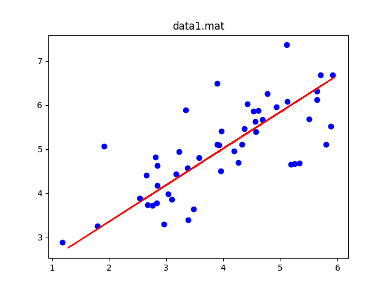
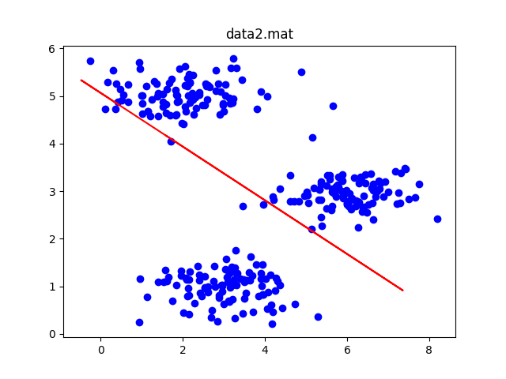
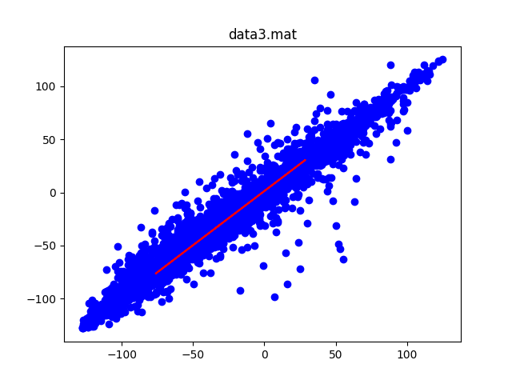
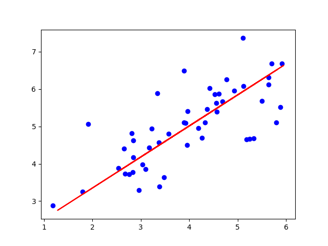

# HW5 降维

### 1 主成分分析（100）

#### 1.1 输入数据集 （30）

data1.mat中，每一行为一个样本，特征维度为2。

data1.mat中，每一行为一个样本，特征维度为2。

data3.mat为人脸特征数据集，每一行为一个样本，特征维度为1024。

```python
import scipy.io as sio
from os import path

def load_data(mat_name):
    data_dict = sio.loadmat(path.join('HW5 dimension reduction', mat_name))
    X = np.array(data_dict['X'])
    return X

X = load_data('data1.mat')
```

#### 1.2 手搓PCA（40）

不使用sklearn工具包，只使用numpy对data1，data2，data3进行PCA。

```python
import numpy as np

def pca(X, k):
    """
    k:低维空间维度
    """
    # 复制一下
    X = X.copy()
    # 1.对所有样本去中心化
    mean = np.mean(X, axis=0)
    X -= mean
    # 2.计算样本的协方差矩阵
    # rowvar=0代表每行为样本
    sigma = np.cov(X, rowvar=0)
    # 3.对协方差矩阵做特征值分解
    eigenvalues, eigenvectors = np.linalg.eig(sigma)
    # 4.取出最大的k个特征值所对应的特征向量w1,w2,...,wk
    # 逆序
    inds = np.argsort(eigenvalues)[::-1]
    eigenvectors = eigenvectors[:, inds]
    # 降维后的数据
    X_reduct = np.dot(X, eigenvectors[:, :k])
    # 重构数据
    X_approx = np.dot(X_reduct, eigenvectors[:, :k].T)+mean
    return X_reduct, X_approx
```
#### 1.3 分析（30）

- 可视化data1和data2进行PCA之后的投影直线

<center class="half">


</center>

```python
from matplotlib import pyplot as plt

def visualize(X, title):
    # 复制一下
    X_origin = X.copy()
    _, X_recovery = pca(X, 1)
    plt.scatter(X_origin[:, 0], X_origin[:, 1], c='b')
    plt.plot(X_recovery[:, 0], X_recovery[:, 1], c='r')
    plt.title(title)
    plt.show()
```
- 基于实验，分析data3中根据降维程度的不同，信息损失的差异，并选取最优的降维比率。

主要成分分析是减少投射的平均均方误差,训练集的方差为：
$$
\frac{1}{m} {\textstyle \sum_{m}^{i=1}}\left \| x^{(i)}  \right \|  ^{2} 
$$

计算平均均方误差与训练集方差的比例ratio:

$$
\frac{\frac{1}{m} {\textstyle \sum_{m}^{i=1}}\left \| x^{(i)}-x_{approx}^{(i)}   \right \|  ^{2} }{\frac{1}{m} {\textstyle \sum_{m}^{i=1}}\left \| x^{(i)}  \right \|  ^{2} } 
$$

如果这个比例小于r%，就意味着原本数据的偏差有1-r%都保留下来了，便能非常显著地降低模型中特征的维度了。

随着低维维度k的不断上升，比例ratio也在不断的降低。而查阅资料得知学术界标准为95%，在对人脸识别的数据进行PCA时，当k=516,比例为4.99%恰好符合这一标准

```python
def choose_best_k(X):
    best_k = 1
    best_ratio = 1 << 31
    variance = np.sum(np.linalg.norm(X, ord=2, axis=1))
    for k in range(1, X.shape[1]):
        _, X_approx = pca(X, k)
        ratio = np.sum(np.linalg.norm(X-X_approx, ord=2, axis=1)) / variance
        if best_ratio > ratio:
            best_ratio = ratio
            best_k = k
        print('k={},ratio={:.2f}%'.format(k, ratio*100))
    return best_k, best_ratio
```

```bash
k=1,ratio=76.21%
k=2,ratio=68.62%
k=3,ratio=64.48%
k=4,ratio=61.77%
k=5,ratio=59.36%
k=6,ratio=57.79%
k=7,ratio=56.23%
k=8,ratio=54.87%
k=9,ratio=53.65%
k=10,ratio=52.43%
k=11,ratio=51.40%
k=12,ratio=50.38%
k=13,ratio=49.43%
k=14,ratio=48.67%
k=15,ratio=47.95%
k=16,ratio=47.27%
k=17,ratio=46.60%
k=18,ratio=45.97%
k=19,ratio=45.34%
k=20,ratio=44.77%
...
k=475,ratio=5.70%
k=476,ratio=5.68%
k=477,ratio=5.66%
k=478,ratio=5.65%
k=479,ratio=5.63%
k=480,ratio=5.61%
k=481,ratio=5.59%
k=482,ratio=5.57%
k=483,ratio=5.55%
k=484,ratio=5.54%
k=485,ratio=5.52%
k=486,ratio=5.50%
k=487,ratio=5.48%
k=488,ratio=5.47%
k=489,ratio=5.45%
k=490,ratio=5.43%
k=491,ratio=5.41%
k=492,ratio=5.40%
k=493,ratio=5.38%
k=494,ratio=5.36%
k=495,ratio=5.34%
k=496,ratio=5.33%
k=497,ratio=5.31%
k=498,ratio=5.29%
...
```

#### 1.4 Bonus（10）

- 使用sklearn工具包对data1进行降维，并进行可视化。

代码如下：

    ```python
    from sklearn.decomposition import PCA

    def sklearn_mat1():
        file_name = 'data1.mat'
        X = load_data(file_name)
        pca = PCA(n_components=1)
        # 降维
        X_reduct = pca.fit_transform(X)
        # 还原
        X_approx = np.dot(X_reduct, pca.components_)+np.mean(X, axis=0)
        plt.scatter(X[:, 0], X[:, 1], c='b')
        plt.plot(X_approx[:, 0], X_approx[:, 1], c='r')
        plt.show()
    ```
- 用可视化对比分析sklearn实现和numpy实现

    对比两张图还没发现差异

